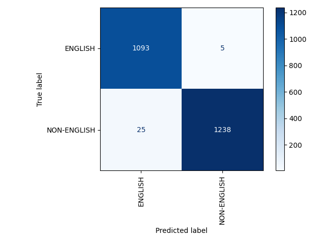

# NLP ASSIGNMENTS
## Assignment 1
For the first assignment I've chosen the [genesis corpus](https://raw.githubusercontent.com/nltk/nltk_data/gh-pages/packages/corpora/genesis.zip) because it contains multiple languages useful for training a classifier.

Specifically I've chosen four corpora:
- english-kjv
- english-web
- finnish
- french

Although the corpus contains more languages I've chosen 2 non english corpora to maintain the dataset balanced because
from previous machine learning courses I've learned that imbalanced datasets might cause the model not to behave well.

The Train Test Split that I've chosen is respectively 70 and 30%, that is a common split in Machine Learning.
### Results

As we can see from the Confusion Matrix most of the tokens are correctly predicted

For measuring the performance of the classifier I've employed 3 Metrics:
- **Accuracy:** Indicates the number of correct predictions out of the total number of predictions
- **Precision:** Indicates what fraction of positive predictions are correct.
- **Recall**:  indicates what fraction of all positive instances does the classifier correctly identify as positive.
- **F1**: combines precision & recall into a single number

The results are respectively 0.997, 0.995, 1 and 0.997 those are great results.

